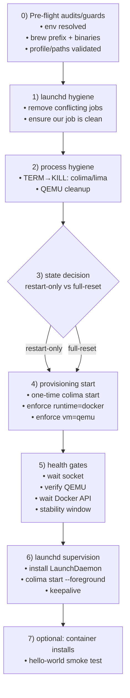

# 🚀 Colima Pulse

**Deterministic Docker Infrastructure for macOS**  
*Colima • QEMU • LaunchDaemon • Terminal-first • Zero drift*

<div align="left">


</div>

---

## 🎯 What this is

**Colima Pulse** is a hardened, reproducible way to bring up **Docker on macOS** using:

- **Colima** (VM wrapper)
- **QEMU** (forced; never VZ)
- **system `launchd` LaunchDaemon** supervision (boot domain; no GUI session required)
- **deterministic health gates** (QEMU mode, sockets, Docker API readiness)
- optional container “installers” for smoke-testing (e.g., `hello-world`)

This is for machines where Docker should behave like **infrastructure**, not “whatever happens when I open Terminal”.

---

## ✅ Locked goals (do not relax)

- **ALWAYS QEMU** (never VZ)
- **Docker runtime**
- **system LaunchDaemon** supervising `colima start --foreground`
- **must run as `HOMEBREW_USER`** (via `su - USER -c ...`)
- **deterministic startup gates**
- **no-drift workflow** (scripted, inspectable, reproducible)

---

## ⚙️ Configuration model (SAFE by design)

Colima Pulse splits configuration into two categories:

### 1) Stable configuration (`.env`)
`.env` is for **machine settings** that should be safe to keep around:

- `HOMEBREW_USER` (required)
- Colima profile and resource limits (`COLIMA_*`)
- logging and launchd labels (`LABEL`, `LOG_PATH`)
- prune preferences (`PRUNE_*`)
- health gate timeouts (`WAIT_*`)
- backup destination base path (used only when you explicitly run `--full-reset`)

Think: *“how this machine should run every day.”*

### 2) Dangerous / one-off actions (CLI flags)
Anything that deletes or rewrites state is intentionally **opt-in at runtime**:

- `--full-reset` (destructive reprovision)
- `--backup=move|prompt|false` (how to handle existing state before deletion)
- `--confirm-token=WORD` (interactive safety)
- `--force-yes` (required for destructive non-interactive runs)

Think: *“I am choosing to do something dangerous right now.”*

#### Why “danger switches” are hard-coded in the script
You will see defaults like this inside the script:

```bash
# Enforce runtime model: danger switches are NOT allowed to be driven by .env
FULL_RESET="false"
FORCE_YES="false"
RESET_REQUIRE_CONFIRM="true"
RESET_CONFIRM_TOKEN="DESTROY"
RESET_BACKUP_MODE="move"     # move|prompt|false
```

This is deliberate:

- It prevents a cloned repo (or a copied `.env`) from accidentally becoming destructive.
- It ensures **restart-only is always the default** unless the operator explicitly passes flags.
- It keeps `.env.example` truly **safe** for public sharing.
- It makes “danger” an explicit, auditable command-line decision (great for runbooks and CI).

**Precedence rule:** CLI flags override these defaults for the current run.

---

## 🧭 The boot model at a glance

From cold boot to Docker-ready, Colima Pulse follows this lifecycle:



<details>
<summary>ASCII version (terminal-friendly)</summary>

```text
┌───────────────────────────────────────────────────────────────────────┐
│                         Colima Pulse lifecycle                         │
└───────────────────────────────────────────────────────────────────────┘
           │
           ▼
┌──────────────────────────────┐
│ 0) Pre-flight audits/guards  │
│   - env resolved             │
│   - brew prefix + binaries   │
│   - profile/paths validated  │
└───────────────┬──────────────┘
                │
                ▼
┌──────────────────────────────┐
│ 1) launchd hygiene           │
│   - remove conflicting jobs  │
│   - ensure our job is clean  │
└───────────────┬──────────────┘
                │
                ▼
┌──────────────────────────────┐
│ 2) process hygiene           │
│   - TERM→KILL: colima/lima   │
│   - QEMU cleanup             │
└───────────────┬──────────────┘
                │
                ▼
┌──────────────────────────────┐
│ 3) state decision            │
│   - restart-only (default)   │
│   - full-reset (destructive) │
│     + optional backup modes  │
└───────────────┬──────────────┘
                │
                ▼
┌──────────────────────────────┐
│ 4) provisioning start        │
│   - one-time colima start    │
│   - enforce: runtime=docker  │
│   - enforce: vm=qemu         │
└───────────────┬──────────────┘
                │
                ▼
┌──────────────────────────────┐
│ 5) health gates              │
│   - wait socket              │
│   - verify QEMU              │
│   - wait Docker API          │
│   - stability window         │
└───────────────┬──────────────┘
                │
                ▼
┌──────────────────────────────┐
│ 6) launchd supervision       │
│   - install LaunchDaemon     │
│   - run: colima --foreground │
│   - keepalive                │
└───────────────┬──────────────┘
                │
                ▼
┌──────────────────────────────┐
│ 7) optional: containers      │
│   - hello-world smoke test   │
└──────────────────────────────┘
```

</details>

---

## 🧠 Why QEMU (not VZ)

On Apple Silicon, macOS Virtualization.framework (“VZ”) can be fast for interactive dev, but Colima Pulse optimizes for **boot/session determinism**, not peak performance.

Colima Pulse chooses:
- ✅ **QEMU + system LaunchDaemon supervision** (consistent “no GUI session required” behavior)
- ❌ not VZ (even if faster), because determinism > speed

---

## 🔐 FileVault and unattended reboots (important)

FileVault encrypts the startup disk at rest. On macOS, **after a reboot the disk must be unlocked** before user home directories (`/Users/...`) are available.

**What this means for Colima Pulse:**
- Colima Pulse can run without a logged-in user, but it still relies on the target user’s home directory (Colima state under `~/.colima`, configs/log paths).
- If FileVault is enabled and the Mac has just rebooted, **LaunchDaemons may start, but they cannot fully bring Colima up until the disk is unlocked at least once.**
- After the first unlock following boot, Colima Pulse can run without a user session (logged out is fine) and keep containers alive across logouts.

### ✅ Practical outcomes
- **FileVault ON + normal reboot:** containers are **not guaranteed** to start until someone unlocks the disk once.
- **FileVault OFF:** containers can start **fully unattended after reboot** (subject to power/network).
- This is not “QEMU vs VZ”. It’s **boot-time disk unlock determinism**.

### If your goal is: “After any reboot, containers must come back without a human”
Pick one:
1) Disable FileVault on the host running Colima Pulse (maximum unattended determinism)  
2) Keep FileVault enabled, but accept: a human must unlock the disk after reboot  
3) Use enterprise-managed “authorized restart / management tooling” (managed environments)

---

## 📦 What’s in this repo

- `colima-pulse.sh` — canonical bootstrap/provision/supervise script
- `.env.example` — safe template (copy to `.env`)
- `containers/` — local installer drop-zone + safe examples/docs (`containers/README.md`)

---

## ✅ Requirements

- macOS (Intel or Apple Silicon)
- Homebrew installed  
  - Apple Silicon: `/opt/homebrew`  
  - Intel: `/usr/local`
- Admin rights (system LaunchDaemon install)

---

## 🧰 Install (Homebrew deps)

Colima Pulse expects these tools to exist (via Homebrew), and will install missing ones automatically:

- `colima`
- `docker`
- `qemu`

### Recommended (normal path)
1) Make the script executable (first time only)
2) Run it — it will detect Homebrew prefix, check dependencies, and install anything missing

```bash
chmod +x ./colima-pulse.sh
./colima-pulse.sh
```

### Manual install (optional)
If you prefer installing prerequisites yourself:

```bash
brew install colima docker qemu
```

> Note: QEMU is mandatory for Colima Pulse because the runtime model is **QEMU-only** (never VZ).

---

## ⚙️ Setup (.env)

Copy and edit:

```bash
cp .env.example .env
$EDITOR .env
```

Minimum required:
- `HOMEBREW_USER`

Common tuning:
- `COLIMA_PROFILE`, `COLIMA_CPUS`, `COLIMA_MEMORY`, `COLIMA_DISK`
- `LABEL`, `LOG_PATH`
- `BACKUP_DIR_BASE` (used only when you explicitly run `--full-reset`)
- `PRUNE_DOCKER_AFTER_START`, `PRUNE_MODE`
- `WAIT_SOCKET_MAX`, `WAIT_DOCKER_API_MAX`, `WAIT_QEMU_MAX`, `WAIT_STABLE_REQUIRED`

---

## ▶️ Usage (copy/paste)

> Prefer `./colima-pulse.sh ...` (not `zsh ./...`) to avoid extra shells and keep TTY/stdout behavior predictable.

### Show help / options
```bash
./colima-pulse.sh --help
```

### Restart-only (safe default)
Keeps existing Colima state directories.
```bash
./colima-pulse.sh
```

### Full reset (destructive)
Reprovisions Colima by deleting/rebuilding state (with safety confirmation).
```bash
./colima-pulse.sh --full-reset
```

### Full reset + choose backup behavior
`--backup=move` is the default (recommended).
```bash
./colima-pulse.sh --full-reset --backup=move
./colima-pulse.sh --full-reset --backup=prompt
./colima-pulse.sh --full-reset --backup=false
```

### Full reset + custom confirmation token (interactive)
Default token is `DESTROY`.
```bash
./colima-pulse.sh --full-reset --confirm-token=DESTROY
```

### Non-interactive destructive runs (launchd / CI / cron)
`--force-yes` exists to allow `--full-reset` when there is **no TTY**.
It does **not** mean “skip typed confirmation” in an interactive Terminal.
```bash
./colima-pulse.sh --full-reset --force-yes
```

### Optional: skip typed confirmation (only if supported by your script)
If your `--help` output includes `--no-confirm`, you can use:
```bash
./colima-pulse.sh --full-reset --no-confirm
# or (for non-interactive + no-confirm)
./colima-pulse.sh --full-reset --force-yes --no-confirm
```

---

## 🧷 launchd supervision model

Colima Pulse uses a **system LaunchDaemon** (system domain) to supervise:

- `su - $HOMEBREW_USER -c "… colima start --foreground …"`

Why this model:
- LaunchAgents require user login (not acceptable for sessionless Docker)
- LaunchDaemons can start at boot, but must drop privileges to the Homebrew user so ownership, paths, and Colima state remain correct

Useful commands:
```bash
sudo launchctl print system | grep -i colima
sudo launchctl print system/<LABEL>
sudo launchctl kickstart -k system/<LABEL>
sudo launchctl bootout system/<LABEL>
```

---

## 🧪 Containers smoke test: hello-world

A minimal example container installer lives here:

- `containers/hello-world/`

Purpose:
✅ validate end-to-end readiness:
- Colima up
- Docker socket ready
- Docker API responding
- pull/run works

---

## 🔒 containers/ security policy

The `containers/` folder is local-by-default because real installers may include secrets.

- The repo commits only documentation + sanitized examples/templates
- Real installers remain local and should be git-ignored

Authoritative policy:
- `containers/README.md`

---

## 🧯 Troubleshooting

Docker API readiness:
```bash
colima status
docker context ls
docker info
```

Not using QEMU:
- check for profile overrides
- check for competing system services

Works after login but not after reboot:
- read **FileVault and unattended reboots** above

---

## 🏷️ License

MIT — see `LICENSE`

---

## 💬 The human bit (why this exists)

Most macOS Docker setups are “good enough” until the day you actually need them to behave like infrastructure:

- the machine reboots while you’re not there
- the desktop session isn’t logged in
- a daemon fights another daemon
- Docker looks “up” but the API isn’t ready
- something silently flips modes and your boot semantics change

**Colima Pulse is the antidote.**

It’s not trying to be clever.  
It’s trying to be **boringly correct**.

If you want a Mac that boots and quietly does its job —  
**this is for you.**
