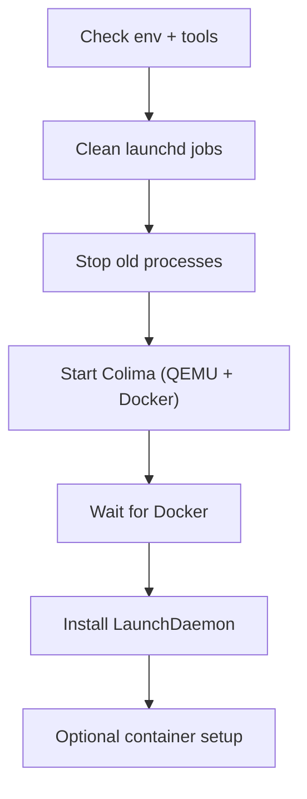

# 🚀 Colima Pulse

**Docker on macOS that actually starts when your Mac boots**  
*Colima • QEMU • LaunchDaemon*

<div align="left">


</div>

---

## 🎯 What this is

**Colima Pulse** turns a Mac into something it normally isn’t:

👉 a machine that brings up Docker **at boot, before anyone logs in**

No GUI. No menu bar. No “open Terminal and try again”.

If you’ve ever hit:
- “Docker only works after I log in”
- “After reboot, nothing is running”
- “My remote access depends on a container… and it didn’t start”

This is for you.

---

## ✨ What you get

- 🟢 Docker starts **at boot**
- 🟢 Containers can run **before login**
- 🟢 Works on **Intel + Apple Silicon**
- 🟢 No background apps or UI required
- 🟢 Recovers cleanly after reboot or power loss

This is especially useful for:
- VPN / tunnel / connector containers (Twingate, Tailscale, etc.)
- home lab setups
- remote access workflows
- “set it and forget it” machines

---

## ⚙️ Key choices (intentional)

These aren’t accidents — they’re why this works:

- Uses **QEMU** (not VZ)
- Uses **Docker runtime**
- Runs under a **system LaunchDaemon**
- Executes as your Homebrew user
- Waits until Docker is actually usable before continuing
- Reset is **explicit only** (safe by default)

---

## ✅ Requirements

- macOS  
- Homebrew  
- Admin rights (for LaunchDaemon install)

That’s it.

---

## 🧰 Install + run

```bash
git clone https://github.com/MrCee/colima-pulse
cd colima-pulse
cp .env.example .env
nano .env   # or nvim
./colima-pulse.sh
```

If anything is missing, the script installs:
- `colima`
- `docker`
- `qemu`

---

## ⚙️ Configuration (.env)

`.env` is your machine config.

Minimum:
- `HOMEBREW_USER`

Common options:
- CPU / memory / disk sizing
- logging location
- startup timing controls
- container retry behaviour
- optional cleanup settings

---

## ▶️ Usage

| Goal | Command |
|---|---|
| Restart (default) | `./colima-pulse.sh` |
| Help | `./colima-pulse.sh --help` |
| Full reset | `./colima-pulse.sh --full-reset` |
| Reset + backup move | `--backup=move` |
| Reset + prompt | `--backup=prompt` |
| Reset + no backup | `--backup=false` |
| Non-interactive reset | `--force-yes` |
| Custom confirm token | `--confirm-token=DESTROY` |

---

## 🔧 What happens under the hood

Each run follows a simple flow:

1) Load config + tools  
2) Clean up anything conflicting  
3) Stop leftover processes  
4) Start Colima (QEMU + Docker)  
5) Wait until Docker actually responds  
6) Install/update a LaunchDaemon so it keeps running  

<details>
<summary><strong>Boot flow (optional)</strong></summary>


```mermaid
flowchart TD
  A["Check env + tools"] -->
  B["Clean launchd jobs"]
  B --> C["Stop old processes"]
  C --> D["Start Colima (QEMU + Docker)"]
  D --> E["Wait for Docker"]
  E --> F["Install LaunchDaemon"]
  F --> G["Optional container setup"]
```

</details>

---

## 🧠 Why QEMU (not VZ)

VZ is great for dev.

This project is about:
- starting before login
- running under launchd
- behaving consistently after reboot

QEMU handles those scenarios more reliably.

---

## 🔐 FileVault note (important)

macOS won’t expose `/Users/...` until the disk is unlocked.

So:

- **FileVault ON** → containers may wait until first unlock  
- **FileVault OFF** → fully automatic startup  

This is macOS behaviour — not a limitation of this project.

---

## 🧷 launchd commands

LaunchDaemon label:
- `homebrew.mrcee.colima-pulse`

Useful checks:

```bash
sudo launchctl print system | grep -i colima
sudo launchctl print system/homebrew.mrcee.colima-pulse
sudo launchctl kickstart -k system/homebrew.mrcee.colima-pulse
sudo launchctl bootout system/homebrew.mrcee.colima-pulse
```

---

## 🧪 Smoke test

Included example:

```
containers/hello-world/
```

Verifies:
- Colima is running
- Docker is reachable
- containers can start

---

## 🔒 containers/ note

- Repo includes examples only  
- Real configs (especially secrets) should stay local  

---

## 🧯 Troubleshooting

Quick checks:

```bash
colima status
docker context ls
docker info
```

Common issues:

- **Only works after login** → see FileVault section  
- **Not using QEMU** → check profile / conflicts  
- **Docker not responding** → re-run and watch output  

---

## 📦 Repo contents

- `colima-pulse.sh` — main script  
- `.env.example` — config template  
- `containers/` — examples  

---

## 🏷️ License

MIT

---

## 💬 Why this exists

Because “Docker starts after login” isn’t good enough.

What you want is:

- reboot the Mac  
- Docker becomes available  
- your containers start  
- before login  

No clicking. No babysitting.

Just:

👉 **boot → ready → running**
