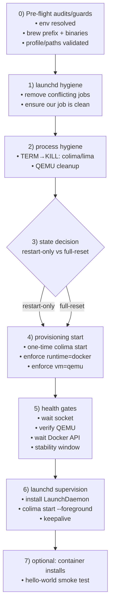

# 🚀 Colima Pulse

**Deterministic Docker Infrastructure for macOS**  
*Colima • QEMU • LaunchDaemon • Terminal-first • Zero drift*

<div align="left">


</div>

---

## 🎯 What this is

**Colima Pulse** turns a Mac into a “quiet little server” for Docker.

It’s designed to bring up **Docker and your important containers at boot, before desktop login** — no clicking, no GUI session, no “open Terminal and try again” rituals.

If you’ve ever had:
- “Docker only works after I log in”
- “After reboot, nothing is running until I touch it”
- “Remote access depends on a container… and that container doesn’t start”
…this is built to make that stop.

---

## ✨ The big win: containers at boot (before login)

Anything you can express as a `docker run ...` command can be brought up automatically at boot — **before anyone logs in**.

That matters when:
- **Remote access depends on it** — your tunnel/VPN/connector is a container
- **The Mac is acting like a home-lab node** — it hosts services, not just apps
- **You want automatic recovery** — power loss / updates / reboots should self-heal
- **Login timing is unknown** — shared machines, office Macs, headless setups
- **You’re tired of false “Docker is up”** — Colima Pulse gates on real readiness

---

## ✅ Locked goals (Frankie says: don’t relax)

These are the “if you change this, it’s a different project” rules:

- **ALWAYS QEMU** (never VZ)
- **Docker runtime**
- **system LaunchDaemon** supervising `colima start --foreground`
- **must run as `HOMEBREW_USER`** (via `su - USER -c ...`)
- **deterministic startup gates**
- **restart-only is the default** (destructive actions are explicit CLI flags)

---

## ✅ Requirements

- macOS
- Homebrew
- Admin rights (system LaunchDaemon install)

That’s it — Intel vs Apple Silicon is handled by the script.

---

## 🧰 Install (git clone) + run

```bash
git clone https://github.com/MrCee/colima-pulse
cd colima-pulse
cp .env.example .env
nano .env   # or: nvim .env
./colima-pulse.sh
```

The script will install missing Homebrew dependencies automatically (if needed):
- `colima`
- `docker`
- `qemu`

---

## ⚙️ Configuration (.env)

`.env` is **stable machine configuration** (safe to keep around).  
**Destructive/reset choices are runtime CLI flags**, not `.env` keys.

Minimum required:
- `HOMEBREW_USER`

Common tuning:
- `COLIMA_PROFILE`, `COLIMA_CPUS`, `COLIMA_MEMORY`, `COLIMA_DISK`
- `LOG_PATH`
- `BACKUP_DIR_BASE` (used only when you run `--full-reset`)
- `PRUNE_DOCKER_AFTER_START`, `PRUNE_MODE`
- `WAIT_SOCKET_MAX`, `WAIT_DOCKER_API_MAX`, `WAIT_QEMU_MAX`, `WAIT_STABLE_REQUIRED`
- `CONTAINER_TRIES`, `CONTAINER_DEBUG_SCRIPT`

---

## ▶️ Usage

| Goal | Command |
|---|---|
| Safe restart (default) | `./colima-pulse.sh` |
| Help / options | `./colima-pulse.sh --help` |
| Full reset (destructive) | `./colima-pulse.sh --full-reset` |
| Full reset + backup move | `./colima-pulse.sh --full-reset --backup=move` |
| Full reset + backup prompt | `./colima-pulse.sh --full-reset --backup=prompt` |
| Full reset + no backup | `./colima-pulse.sh --full-reset --backup=false` |
| Non-interactive destructive run (CI/launchd/cron) | `./colima-pulse.sh --full-reset --force-yes` |
| Custom confirmation token (interactive) | `./colima-pulse.sh --full-reset --confirm-token=DESTROY` |

---

## 🔧 How it works (so the boot magic isn’t “trust me bro”)

Colima Pulse does the same sequence every time:

1) resolves env + tools (Homebrew, paths, profile)  
2) removes conflicting launchd jobs (if any)  
3) stops stale `colima/lima` processes  
4) starts Colima as **QEMU + Docker runtime**  
5) waits for **socket + Docker API** (and a short stability window)  
6) installs/refreshes a **system LaunchDaemon** to keep it running pre-login

<details>
<summary><strong>Boot lifecycle diagram (optional)</strong></summary>


```mermaid
flowchart TD
  A["0) Pre-flight audits/guards<br/>• env resolved<br/>• brew prefix + binaries<br/>• profile/paths validated"] -->
  B["1) launchd hygiene<br/>• remove conflicting jobs<br/>• ensure our job is clean"]
  B --> C["2) process hygiene<br/>• TERM→KILL: colima/lima<br/>• QEMU cleanup"]
  C --> D{"3) state decision<br/>restart-only vs full-reset"}
  D -->|restart-only| E["4) provisioning start<br/>• one-time colima start<br/>• enforce runtime=docker<br/>• enforce vm=qemu"]
  D -->|full-reset| E
  E --> F["5) health gates<br/>• wait socket<br/>• verify QEMU<br/>• wait Docker API<br/>• stability window"]
  F --> G["6) launchd supervision<br/>• install LaunchDaemon<br/>• colima start --foreground<br/>• keepalive"]
  G --> H["7) optional: container installs<br/>• hello-world smoke test"]
```

</details>

---

## 🧠 Why QEMU (not VZ)

VZ can be faster for interactive dev.  
Colima Pulse optimizes for **boot/session determinism**:

- ✅ QEMU + system LaunchDaemon supervision = consistent “no GUI login required” behavior
- ❌ VZ = great in many cases, but not the target mode for this project

---

## 🔐 FileVault and unattended reboots (important)

macOS needs the startup disk unlocked after reboot before user home directories (`/Users/...`) are available.

Practical outcomes:
- **FileVault ON:** after reboot, containers may not start until someone unlocks the Mac once
- **FileVault OFF:** best chance of fully unattended “boots and runs” behavior

This is macOS disk unlock behavior, not a Colima quirk.

---

## 🧷 launchd operations

Colima Pulse installs a **system LaunchDaemon** which runs Colima as `HOMEBREW_USER`.

Job label:
- `homebrew.mrcee.colima-pulse`

Useful commands:
```bash
sudo launchctl print system | grep -i colima
sudo launchctl print system/homebrew.mrcee.colima-pulse
sudo launchctl kickstart -k system/homebrew.mrcee.colima-pulse
sudo launchctl bootout system/homebrew.mrcee.colima-pulse
```

---

## 🧪 Smoke test: hello-world

A minimal end-to-end smoke test lives in:
- `containers/hello-world/`

It validates:
- Colima up
- Docker socket ready
- Docker API responds
- pull/run works

---

## 🔒 `containers/` policy (short)

`containers/` supports **local installers** (which may include secrets).

- The repo should commit only **documentation + sanitized examples**
- Real installers remain local and should be git-ignored

Authoritative: `containers/README.md`

---

## 🧯 Troubleshooting

Fast checks:
```bash
colima status
docker context ls
docker info
```

Common symptoms:
- **Works after login but not after reboot:** read **FileVault and unattended reboots** above
- **Not using QEMU:** check profile overrides and competing services
- **Docker “up” but API not responding:** re-run the script and watch the readiness gates in the output

---

## 📦 What’s in this repo

- `colima-pulse.sh` — canonical bootstrap/provision/supervise script
- `.env.example` — safe template (copy to `.env`)
- `containers/` — optional smoke tests / local installers

---

## 🏷️ License

MIT — see `LICENSE`

---

## 💬 Why this exists (the punchline)

Because **“starts after login” is not infrastructure** — it’s a suggestion.

Colima Pulse is the “no-questions-asked” boot strategy for Docker on macOS:

- **reboot the Mac**
- **Docker becomes ready**
- **your containers come up**
- **before anyone logs in**

No clicking. No “open the app”. No “try it twice”.  
Just: **boot → ready → running**.

